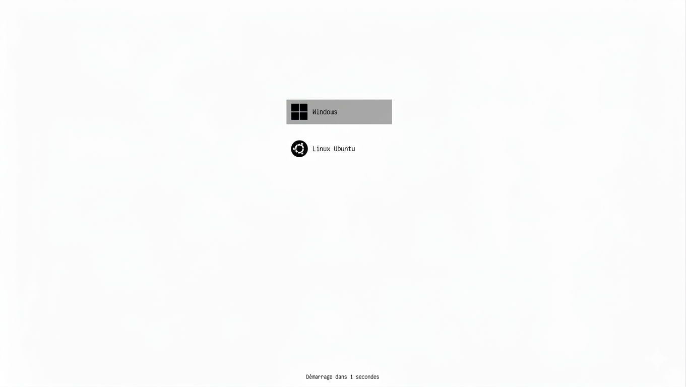

# GRUB-Michka

A clean, minimalist GRUB2 theme with a white background and monochrome icons.



---

## Features

- White background
- Monochrome icons (Ubuntu & Windows)
- Clean selection indicator
- Countdown timer at the bottom of the screen
- Ubuntu Sans font

## File structure

\`\`\`
GRUB-Michka/
├── background.png
├── theme.txt
├── fonts/
│   └── ubuntu-sans-14.pf2
├── icons/
│   ├── ubuntu.png
│   └── windows.png
├── select_*.png
└── terminal_box_*.png
\`\`\`

## Installation

**1. Clone the repository**
```bash
git clone https://github.com/ton-username/GRUB-Michka.git
```

**2. Copy the theme to the GRUB themes folder**
```bash
sudo cp -r GRUB-Michka /boot/grub/themes/
```

**3. Edit the GRUB configuration**
```bash
sudo nano /etc/default/grub
```
Make sure this line is present:
'''
GRUB_TIMEOUT_STYLE=menu
'''

**4. Create a custom script to load the theme**
```bash
sudo nano /etc/grub.d/06_custom_theme
```
Add the following content:
```bash
#!/bin/sh
echo "set theme=/boot/grub/themes/GRUB-Michka/theme.txt"
echo "export theme"
```
Make it executable:
```bash
sudo chmod +x /etc/grub.d/06_custom_theme
```

**5. Disable the default Ubuntu theme script**
```bash
sudo chmod -x /etc/grub.d/05_debian_theme
```

**6. Update GRUB and reboot**
```bash
sudo update-grub
sudo reboot
```

## Compatibility

- Ubuntu 24.04+
- GRUB 2.12+
- Secure Boot compatible
- Tested on 1920×1080

## License

MIT
